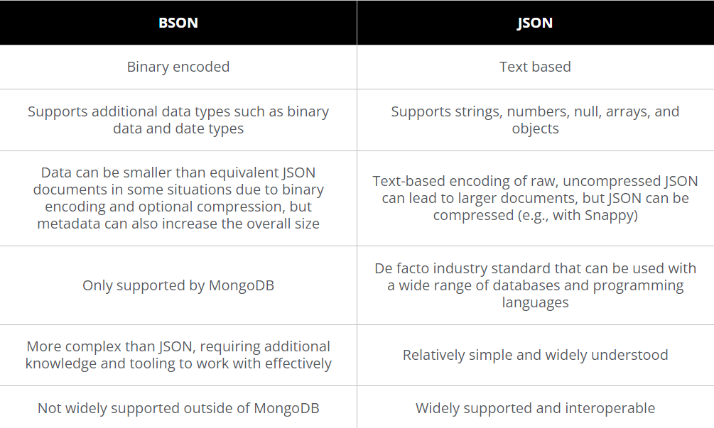

# MongoDB_Quick
This project demonstrates the use of MongoDB, a NoSQL database, for efficient data storage and retrieval. It includes examples of connecting to MongoDB, performing CRUD (Create, Read, Update, Delete) operations, and implementing best practices for database design and performance optimization.

#Features 

- Connection to MongoDB using different drivers (e.g., Node.js, Python, etc.)
- CRUD operations examples
- Database schema design best practices
- Indexing and performance optimization techniques
- Data aggregation and query examples
- Backup and restore procedures
- Security configurations and best practices

Installation

Prerequisites

- MongoDB installed (version X.X.X or later)
- Node.js, Python, or another programming language environment (depending on your examples)
- Git
  
Steps:

1. Clone the repository:

```git clone https://github.com/yourusername/mongodb-project.git```

2. Navigate to the project directory:

```cd mongodb-project```

3. Install dependencies (if any):

``` npm install ```

Or

```pip install -r requirements.txt```
<br>
<br>

## What is JSON ?

JSON was originally derived from a subset of the JavaScript programming language syntax, so it shares many of the same syntax rules and data types as JavaScript. As a result, JSON can be easily parsed and generated using JavaScript and is often used in web development for exchanging data between client-side JavaScript and server-side programs written in various programming languages.

 

Because JSON is lightweight, it is efficient to transmit over a network, which is important for web-based applications that need to transfer data quickly. JSON’s user-friendly format allows it to be easily understood and edited by developers and non-developers alike. And because it’s easy for machines to parse and generate, JSON can be easily integrated into a wide range of programming languages and platforms, making it a versatile and widely adopted format for exchanging data.

<br>
## WHat is BSON ?


BSON is a binary-encoded format, whereas JSON is a text-based format. This means that BSON is compact for transmitting over a network, while JSON is human-readable and easier to work with in various contexts. 

<br>

